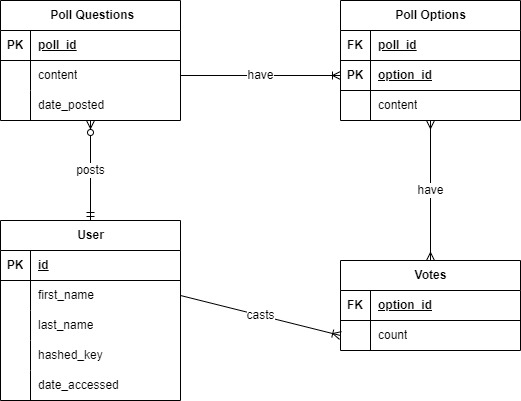

___
# Code Foo Polling App 

### A lightweight desktop polling app built on PyQt6 and SQLiteDB.
___
  

*This software is intellectual property of Marcus Antonelli. Do not distribute the contents for financial or personal gain. You cannot use substantial amounts of source code without permission. Any breaches of this software's copyrighted source code can and will be met with legal action.*

  

## First Draft
___________
  
The initial draft of the project was based on the idea that the app would be a web app, not a desktop app. The app was to run locally on your browser.

I utilized HTML and CSS to create the frontend, and began work with ajax tools and PHP to build basic scripts for the database logic. At this point, I hadn't even put any thought into how I was going to set up the database, hosting, etc. This became a challenge for a few days.

After reconsidering the first draft's setup, I began experimenting.

  

## Draft 1.5
___________
  
The "draft" in-between the first and second draft was shortlived. In this stage, I began experimenting with React.js and Azure SQL Servers/Databases. 

I realized that this approach would be time and resource inefficient, and that I'd need to scale back the project into something more lightweight so that I could stay organized and on-time.

Finally, I decided upon a second draft...

  

## Second Draft
___________
  
The second draft was only a minor adaptation of the first draft. This version was intended to be run as a windowed application using Flask and an SQLite database, maintaining the CSS and HTML for the frontend, and rewriting the backend logic in Python.

I began work on this version, but realized that the number of files became overwhelming. Between HTML, stylesheets, dependencies, and scripts, my hands were bound. I've created windowed Flask apps before, but I suspected that the type of app I was envisioning would work better with another library or framework.

I did some research on Google, and I found some results suggesting PyQt for a project similar to mine. I quickly learned how to use PyQt and Qt Editor, and moved on to the third and final draft...

  

## Third and Final Draft
___________

The final draft is what you see today. I removed the HTML, CSS, JavaScript, and all of my Flask app Python files. I installed PyQt6 to my virtual machine, but realized I'd have to downgrade my Python version to escape an issue with the interpreter. 

Next:

1. I installed pyqt_tools
2. I ran `designer.exe` from pyqt_tools
3. I created the .ui file for my app

At this point in the project, I had not actually done anything with the sqlite database. So, I got to work. I decided to write a Python module that would simplify SQLite CRUD operations. This is called `appdb.py` in the *'python'* folder. 

(I will cover the design and development of the database further along in the *README*)

I then filled the database with random data using an SQL script called `init.sql` in the *'sqlite/queries'* path. You can find most of the data currently in the database in some of the **INSERT INTO** statements.

Initially, I filled the *'sqlite/queries'* path with many SQL queries to be read by my app. I eventually opted to create one, large .sql file with all of the queries, and read the content line by line. You can find this logic in the `query_strings.py` module.

**Note:** Be cautious handling the `main.db` file. These files are sensitive and susceptible to data corruption. If this occurs, you may create a new instance from the repository, or copy and paste a new instance of the existing, corrupted database (within the same path *with the same name* if you're seeking app functionality.)

  

## In-Depth Look at PyQt Logic
___________

This project is fully dependent on PyQt6. The `.ui` file generated from Qt Designer can be found in the *'python'* folder. The app has a total of 8 unique pages, each being an index under a QStackedWidget. I've mapped button 'clicked' triggers with index-changing slots in the `pyqt6app.py` file. 

The slots utilize class methods from `appdb.py` to create an instance of a class. Each class in the code represents a table in the database, and each class instance is effectively a table instance. Then, `appdb.py` utilizes `connections.py` to access the database file and process queries. Coding with an object-oriented style in a project like this allows for much more organized, readable code. Creating object attributes mirrors the structure of the database tables and their respective columns.

My Qt forms are created using **QTextEdit** and **QPushButton** widgets, with the **QPushButton**s triggering various CRUD operations. For example, the **QTextEdit** widget's text will be gathered with the *'.text()'* method. Then, the input will be inserted into placeholder spots in the unique query's script body. Again, the **QPushButton** will trigger a connected slot, which will execute a query with the interpolated query-string. 

**Note:** Only the username and password inputs are sniffed for injection strings (currently.)

Many of the pages have initialization steps or in-place actions that dynamically shift the content of the page. These shifts are determined with **READ** operations and mostly **QtWidget** logic. The *'.setText()'*, *'.move()'*, and *'.resize()'* methods are the most common **QtWidgets** methods that you'll see me use in this context.

***Worth Mentioning:*** The logic for hashing and dehashing passwords is dependent on bcrypt. Make sure you have this dependency installed for the downloaded version of this app.

  

## Developing and Designing a Database
___________

I loosely followed the DBLC while developing this project. First, I collected the basic rules/constraints: data must be persistent and similar to IGN's in-text polls. The main objective was to track information for users, polls, poll options, and user votes-- so, with my goal and those constraints in mind, I created a basic ERD:

This model was comprehensive, simple, and effective. Happy with the diagram, I advanced to DBMS selection. As I mentioned previously, I was initially going to use Azure SQL services for my database and Microsoft SQL Server Management Studio as a DBMS.

Due to the nature of this project, I went with an SQLite database as the data storage method. SQLite is an inredible choice for a project like this. The developer is seldom concerned with scalability working with them, and they're: easy to create and maintain, lightweight, and embedded in the software. I'm experienced with relational databases and SQL databases, so I didn't spend any other time looking for other options. In my mind, flat files would not be appropriate for the app, either. Overall, going with an SQLite database eliminated the necessity for PHP files and a DB server.

Database implementation was very straightforward, and only around 20 minutes to get a basic model set up with example data. I used the SQLite viewer extension on Visual Studio Code to view the data. This was mostly for debugging and management purposes.

  

## Database App Integration
___________

The sqlite3 library is included in the Python standard library (most versions.) This library makes Python SQLite processing and management incredibly easy. 

I decided to structure this project modularly, as the main `pyqt6_app.py` is long enough as is. Modular programming worked well for the app.

So, this project can be broken down into this modular hierarchy:

1. `app.ui` <- front-end
2. `pyqt6_app.py` <- front-end wrapper + scripting
3. `appdb.py` <- query/requests logic
4. `connections.py` <- python to .* interface
5. `main.db` <- sqlite database
6. `queries.sql` <- list of sql queries to execute

With these short descriptions, we can now examine the flow of data. First, '*pyqt6_app.py*' grabs the path to `main.db` and `app.ui` and stores them in a global variable. A '*Connection()*' instance is created to represent the database. A '*Gui()*' instance is created, which inherits from '*QMainWindow()*.' Thus, the '*Gui()*' instance displays the contents of our '*QMainWindow*' widget.

We create a '*sqlite3.Cursor()*' instance upon calling the '*.cursor()*' method for a connection. The cursor is used to perform the aforementioned CRUD operations, and it has extremely useful methods such as '*.execute()*', '*.executescript()*', '*.fetchone()*', and '*.fetchall().*' 

Before utilizing the cursor, we must use the '*get_query_strings*' function in '*query_strings.py*' to fetch the appropriate query to execute.

I've wrapped '*.execute()*' and '*.fetchall()*' in the '*query_get*' function of `appdb.py`, and '*.executescript()*' in the '*query_post*' function. These functions will interpolate the query with user input and utilize the appropriate cursor methods to alter the database.

The bulk of the code is in attributes (QWidgets) and '*query_get*'/'*query_post*' functions, so this section should help with any comprehension issues in reading the code.

  

## How to Install/Download
___________

1. To install:

   - Download Poll App.zip
   - Extract the contents into a folder
   - Read the README.txt file if you are NOT running Windows OS
      - Utilize your compatibility software on other operating systems.
   - Run the installer
   - And you're done!
  

   **Disclaimer:** Some people have reported that the installer has issues with the default path ... just create a new folder wherever you'd like and install there.

   **Note:** The Code Foo application page specifies that the code musn't be compiled, and I understand that in converting the project to an executable, I've effectively compiled the Python code. The .exe is for ease of access and simplicity. Feel free to follow the instructions on downloading if you do not want to run the .exe.
  
2. To download (and run):

   - Verify you have Python 3.9 installed
   - Verify you have all dependencies downloaded (see `requirements.txt` in the *'python'* folder.)
   - Download repository as .zip
   - Extract the contents into a folder
   - Open your terminal
   - Change your current directory to {directory}\ign-application\polling-app\python
   - Run `pyqt6_app.py` with the Python 3.9 interpreter

  

**NOTE:** THIS MARKDOWN FILE WILL UNDERGO REVISION MANY TIMES. THE INFORMATION IN THIS FILE IS 100% ACCURATE TO THE BEST OF MY KNOWLEDGE. I WILL COMMIT NEW README VERSIONS WITH EACH UPDATE.

*© 2023 Marcus Antonelli*
